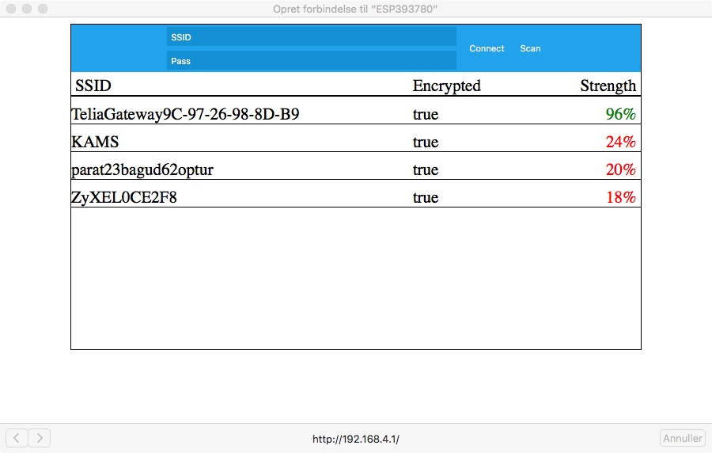

# ESP8266WiFiSetup
A library for connecting the ESP8266 to a WiFi-network using a web server and a captive portal.
Works with the ESP8266 Arduino platform https://github.com/esp8266/Arduino


## Quick Start
- Clone the library to your Arduino libraries folder

- Include the following in your sketch
```cpp
#include <ESP8266WiFiSetup.h>
#include <DNSServer.h>
#include <WiFiClient.h>
#include <ESP8266WebServer.h>
```

- Add the following in your setup method
```cpp
ESP8266WiFiSetup setup;
setup.begin();
```

Your ESP will now try to connect to the latest connected WiFi-network. If it is successful, you can continue doing what you want.
If it fails it will setup an access point with gateway IP 192.168.4.1 (default, can be changed).
Now you can connect to the AP from e.g. your smartphone and it should automatically popup with a custom webpage in which you can select the network to connect to. If this is not the case, I for one couldn't get my Android phone to do this (however it worked fine in OSX), you can go to a browser and enter the gateway IP (192.168.4.1) to get the same webpage.


## Quick Start
See the example for ways to configure the AP.

### Timeout
Say you have a power failure, and your router turns off. The ESP is likely to reboot faster than the router, which in that case will enter the WiFI-setup mode and hang there until a user goes to it's webpage and sets it to connect to a WiFi-network. This is most likely not optimal. To solve this problem, you can set a timeout. If the ESP hasn't been configured during the given time (in seconds), the "setup.begin()"-method will return false, and you can take action accordingly e.g. reboot the ESP.

```cpp
setup.setTimeout(180); //Timeout if it hasn't been configured after 3 minutes
```

#### Inspiration
- AlexT https://github.com/tzapu
